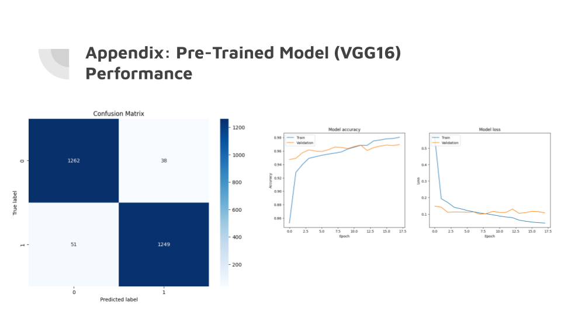

# MIT Applied Data Science Capstone – Malaria Detection Using Deep Learning

This project was completed as part of the **MIT Professional Education Applied Data Science Program**.

The objective was to develop an end-to-end deep learning solution capable of classifying microscopic blood smear images as either **Parasitized** or **Uninfected** to support the early detection of malaria.

---

## Overview

Malaria remains one of the world's most significant infectious diseases, particularly affecting vulnerable populations with limited access to rapid diagnostics. Traditional diagnosis relies on manual examination of blood smear images, a process that is time-intensive and susceptible to human variability.

This project demonstrates how transfer learning and computer vision techniques can be leveraged to improve diagnostic consistency and support healthcare decision-making.

The project combined convolutional neural networks (CNNs), transfer learning, and image classification techniques to develop a high-performing predictive model.

---

## Results

- Achieved **96.6% classification accuracy** on a held-out test set.
- Correctly classified **2,511 of 2,600 microscopic blood smear images**.
- Processed and analyzed over **27,000 microscopic blood smear images**.
- Evaluated multiple CNN architectures and transfer learning approaches.
- Implemented a **VGG16-based transfer learning model**.
- Compared model performance using validation metrics.
- Presented findings during a live **MIT Professional Education Capstone Presentation**.

---

## Model Performance

The final VGG16 transfer learning model demonstrated strong predictive performance and stable convergence throughout training.



### Performance Summary

- **Test Accuracy:** 96.6%
- **Correct Classifications:** 2,511 of 2,600 test images
- **False Positives:** 38
- **False Negatives:** 51
- Training and validation accuracy converged consistently over successive epochs.
- Validation loss remained stable, indicating good generalization to unseen data.

The confusion matrix, accuracy curves, and loss curves demonstrate that the model effectively distinguished parasitized from uninfected blood smear images while maintaining robust performance during training.

---

## Dataset

The project utilized a labeled image dataset containing over **27,000 microscopic blood smear images**.

### Classification Categories

- **Parasitized** – Red blood cells infected with the *Plasmodium* parasite.
- **Uninfected** – Healthy red blood cells without infection.

---

## Project Architecture

```text
Microscopic Blood Smear Images
              ↓
      Data Preprocessing
              ↓
 Image Normalization & Cleaning
              ↓
 Training / Validation Split
              ↓
 Transfer Learning (VGG16)
              ↓
 Model Training & Fine-Tuning
              ↓
 Model Evaluation
              ↓
 Accuracy Comparison
              ↓
 Final Recommendations
```

---

## Methods

This project included:

- Data preprocessing and image normalization
- Exploratory data analysis (EDA)
- Convolutional Neural Network (CNN) development
- Transfer learning implementation
- VGG16 feature extraction and fine-tuning
- Model evaluation and comparison
- Performance optimization using validation metrics

---

## Technologies

### Programming & Libraries

- Python
- TensorFlow
- Keras
- Scikit-Learn
- NumPy
- Pandas

### Development Environment

- Google Colab
- Jupyter Notebook

### Machine Learning Techniques

- Convolutional Neural Networks (CNNs)
- Transfer Learning
- VGG16
- Image Classification
- Model Evaluation

---

## Repository Contents

| File | Description |
|--------|-------------|
| `MIT_Malaria_Detection_Capstone.ipynb` | Complete notebook containing data preparation, model development, and evaluation |
| `MIT_Malaria_Capstone_Presentation.pdf` | Final MIT Professional Education capstone presentation |
| `model_performance.png` | Confusion matrix, training accuracy, and loss visualizations |
| `README.md` | Project overview, methodology, and results |

---

## Business Impact

Early and accurate malaria diagnosis remains a significant global health challenge. Automated classification systems can assist healthcare professionals by improving diagnostic consistency, reducing diagnostic time, and increasing access to reliable screening tools.

This project demonstrates how applied machine learning techniques can address real-world healthcare problems and support data-driven decision-making.

---

## Author

**Michael Kuszpa, Ed.D.**

MIT Professional Education – Applied Data Science Program

LinkedIn: https://www.linkedin.com/in/michael-kuszpa-ed-d-20784910

GitHub: https://github.com/MichaelKuszpa
